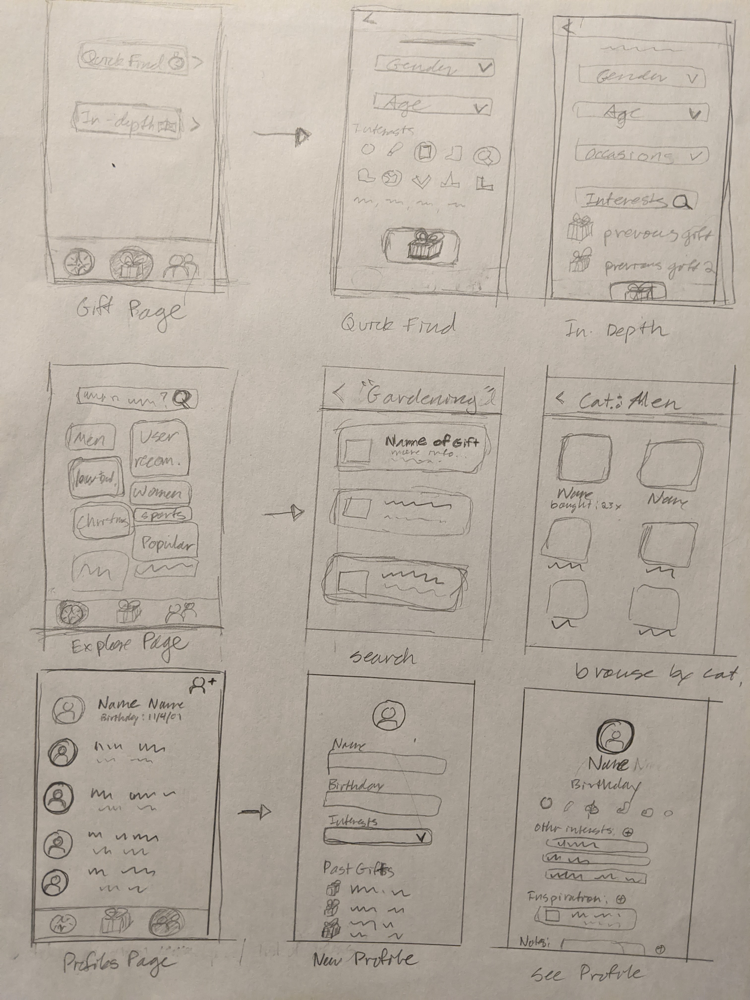
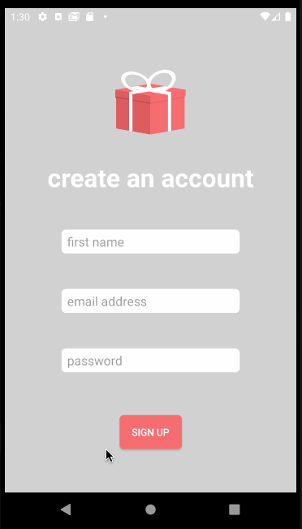

# rudolph

## Table of Contents
1. [Overview](#Overview)
1. [Product Spec](#Product-Spec)
1. [Wireframes](#Wireframes)
2. [Schema](#Schema)

## Overview
### Description
An app to suggest gifts for the people in your life. Makes recommendations based on demographic information and interests of the giftee, as well as feedback from other users.

Built as group project app for Android CodePath 2020 Fall Cohort.

### App Evaluation
[Evaluation of your app across the following attributes]
- **Category:** Social / Lifestyle help
- **Mobile:** Could easily be made for web as well, but app design fits well to smaller screen real estate, and since a section mimics the "contacts" app on a phone, makes sense to put it on a mobile platform. Good for "on the fly" note-taking for gifts, which implies a mobile implementation.
- **Story:** Takes into account multiple sources of information to recommend a genuinely useful, non-trivial gift. Allows you to be more thoughtful about gift-giving and show gratitude for the people in your life.
- **Market:** Other mobile apps focus either on wishlists (predefined by the giftee) or a completely hands-off approach to gift giving (e.g. Giftagram). Seems to be a lack of good, user-friendly gift recommendation apps for phones.
- **Habit:** Used mostly around holidays or birthdays of giftees (which tend to be spread out among a year anyway). Probably sparse but consistent moments of usage.
- **Scope:** Can expand to have more features (ML, card ideas, etc) and can also integrate with other services (Google Calendar API for birhday reminders or Amazon links to specific products). Overall lots of room for broadening out. 

## Product Spec

### 1. User Stories (Required and Optional)

**Required Must-have Stories**

- [ ] user is able to input demographics, relation, and interests of the giftee 
- [ ] user should see list of gift recommendations and categories based on that input
- [ ] rating system for whether the recommendation is good or not - algorithm should take the rating into account
- [ ] user can create profiles for the people in their life that keeps track of their birthday, any other gift-giving holidays they celebrate, interests, gifts previously received, ideas for future gifts, etc.
- [ ] app should take into account what past gifts a person has received and liked, along with their interests, to match gifts for future users
- [x] user can log in with an email address associated with their account

**Optional Nice-to-have Stories**

- [ ] import contact list from phone to create profiles
- [ ] incorporation of Honey API for discounted products
- [ ] browse gifts by category
- [ ] machine learning model for gift recommendation
- [ ] two options for gift browsing: quick find vs in depth search
    - [ ] quick find has shortlist of icons representing different categories/interests
    - [ ] in-depth search includes options for specifiying the occasion (wedding, birthday, religious holiday, etc)
- [ ] images for products/gifts 
- [ ] some sort of method to collect data on gifts and specific products from across the internet

### 2. Screen Archetypes

* Gifting Screen
   * user is able to input demographics, relation, and interests of the giftee 
   * user should see list of gift recommendations and categories based on that input
* Gift/Product Screen
   * rating system for whether the recommendation is good or not - algorithm should take the rating into account
   * description of gift, (maybe) link to purchase, tags
* Profiles Screen
   * user can see all created profiles
* Create New User Screen
   * user can create profiles for the people in their life that keeps track of their birthday, any other gift-giving holidays they celebrate, interests, gifts previously received, ideas for future gifts, etc.
* Explore Screen (Optional)
   * browse gifts by category
   * two options for gift browsing: quick find vs in depth search
    * quick find has shortlist of icons representing different categories/interests
    * in-depth search includes options for specifiying the occasion (wedding, birthday, religious holiday, etc)

### 3. Navigation

**Tab Navigation** (Tab to Screen)

* Gifting Screen
* Profiles Screen
* Explore Screen (Optional)

**Flow Navigation** (Screen to Screen)

* Gifting Screen
   * Click on search bar to be taken to screen to input demographics, interests, etc
    * That screen leads to a list of gift suggestions, which leads to a detail page for each gift
* Profiles Screen
   * Has button top right corner to input new profile (name, birthday, etc)
* Explore Screen (Optional)
   * Tap on category on screen to be taken to list of gifts in that category (similar to Instagram explore page)
   * Tap on search bar to search by name of gift or specific interest

## Wireframes
[Add picture of your hand sketched wireframes in this section]


### [BONUS] Digital Wireframes & Mockups

### [BONUS] Interactive Prototype

## Schema 
### Models
#### Gift

   | Property      | Type     | Description |
   | ------------- | -------- | ------------|
   | objectName    | String   | unique name of product from API |
   | ID            | integer  | Unique product ID |
   | image         | object/file?     | image of product |
   | categories    | List<String>   | list of strings to search for certain product types |
   | rating        | Float   | number between 0 to 5 representing average user rating of product|
   | description   | string   | manufacturer description of product |

#### Categories

   | Property      | Type     | Description |
   | ------------- | -------- | ------------|
   | {    |   |  |
   | sports     | String  | Sports |
   | cheap      | String  | Products <= $25 |
   | over 50    | String  | Products for the elderly |
   | occasion   | String  | Occasion for prodtuct (i.e. weddings, religious ceremonies, etc|
   | }   |    | |

#### User

   | Property      | Type     | Description |
   | ------------- | -------- | ------------|
   | objectName       | String   | unique name of User... maybe a pointer? |
   | Email            | String   | Unique User Email |
   | Password         | String   | Unique password associated to User |
   | Gifting Profiles | List<object>  | List of gifting profile objects |
   | Saved Gifts      | List<object>   | list of saved products|
   
#### Gifting Profiles

   | Property      | Type     | Description |
   | ------------- | -------- | ------------|
   | name                | String   | name of person whom user is searching for gifts |
   | birthday            | String   | birthday of the user |
   | List of Gift Ideas  | List<strings>   | List of possible products for this user |
   | Interests | List<strings>   | List of possible product categories  |
   | demographics      | List<strings>    | Possible category factors based on demographics|
   | Upcoming Occasions | List<strings>   | List of upcoming occasions for product search |


### Networking
#### List of network requests by screen
   - Home Feed Screen
      - (Read/GET) Query all posts where user is author
         ```swift
         let query = PFQuery(className:"Post")
         query.whereKey("author", equalTo: currentUser)
         query.order(byDescending: "createdAt")
         query.findObjectsInBackground { (posts: [PFObject]?, error: Error?) in
            if let error = error { 
               print(error.localizedDescription)
            } else if let posts = posts {
               print("Successfully retrieved \(posts.count) posts.")
           // TODO: Do something with posts...
            }
         }
         ```
      - (Create/POST) Create a new like on a post
      - (Delete) Delete existing like
      - (Create/POST) Create a new comment on a post
      - (Delete) Delete existing comment
   - Create Post Screen
      - (Create/POST) Create a new post object
   - Profile Screen
      - (Read/GET) Query logged in user object
      - (Update/PUT) Update user profile image
      
      
#### [OPTIONAL:] Existing API Endpoints

##### Amazon Web Servives API for Products
- Base URL - [webservices.amazon.com](webservices.amazon.com)

   HTTP Verb | Endpoint | Description
   ----------|----------|------------
    `GET`    | /BrowseNodeInfo.BrowseNodes | Get the browse nodes associated with the item. Using this resource only will return Id, DisplayName, ContextFreeName and IsRoot information associated with each browse node.
    `GET`    | /BrowseNodeInfo.BrowseNodes.SalesRank | Get the SalesRank information with each of the browse nodes the item falls under. 
    `GET`    | /Images.Primary.[Small/Medium/Large]   | Returns sized primary image for each item.
    `GET`    | /ItemInfo.ByLineInfo | Returns set of attributes that specifies basic information of the item.
    `GET`    | /ItemInfo.Classifications | Returns set of attributes that are used to classify an item into a particular category 
    `GET`    | /ItemInfo.ContentInfo   | Returns set of attributes that are specific to the content like Books, Movies, etc.
    `GET`    | /ItemInfo.ProductInfo| Returns set of attributes that describe non-technical aspects of an item.
    `GET`    | /ItemInfo.Title | Returns the title of the product. 
    `GET`    | /Offers.Listings.Availability.Message | Returns Availability message of the product.
    `GET`    | /Offers.Listings.DeliveryInfo.IsPrimeEligible | Returns whether an offer for the product is prime eligible.
    `GET`    | /Offers.Listings.Price| Returns offer buying price of a product.
    
    
#### Build sprint 1 progress

Created basic login flow. 




